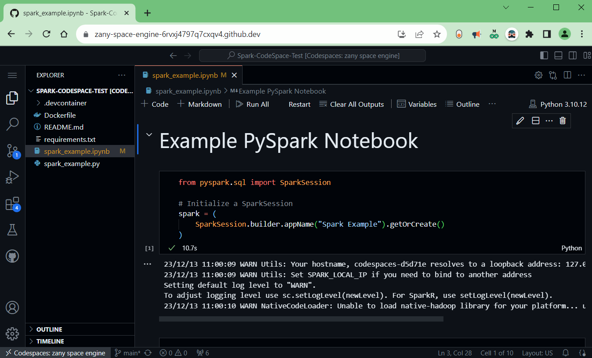

# Spark-CodeSpace-Test

This repo contains all the data needed to complete the AZ Data Science Senior Data Engineer Technical Test.

## Usage
To use codespaces with this repo either click the 'Open in GitHub CodeSpaces' badge at the top of this README, or 'Create codespace on main' from the 'Code' button

This will then launch a VSCode instance within your browser will python, pyspark, and jupyter preinstalled.
 

## AzDETechTest.ipynb
This is the notebook that you will be working out of, please follow the instructions inside the notebook and work through the questions in the time allocated (20 mins). There will be more information about the tasks inside of the notebook.

